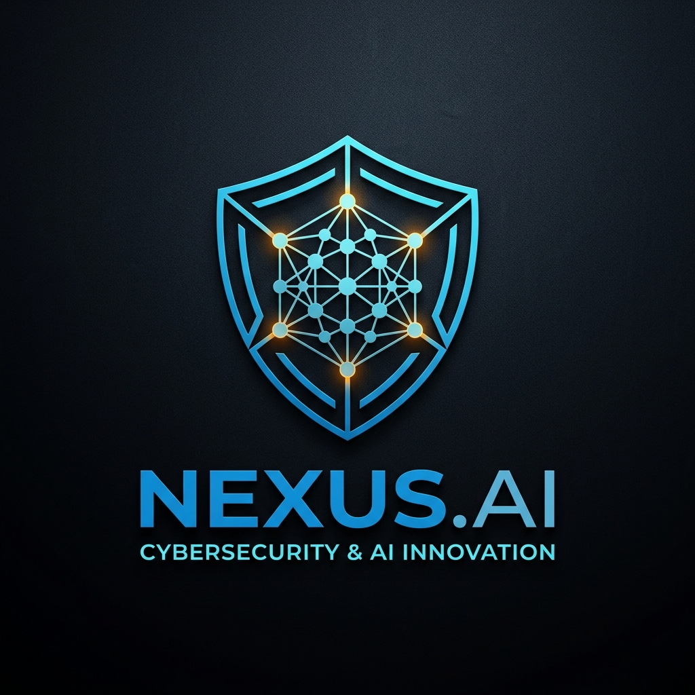

# <p align="center"><br>NEXUS.AI</p>

<p align="center">
  
  
  
  
  
  
</p>

---

## 🛡️ Overview

**NEXUS.AI** is a premium, AI-driven Security Operations Center (SOC) dashboard. It utilizes a sophisticated **4-Layer Neural Architecture** to ingest, detect, correlate, and explain threats in real-time. Designed with a high-end obsidian aesthetic and an interactive amber grid background, NEXUS.AI provides security analysts with an unparalleled command-and-control experience.

## 🚀 Core Features

- **4-Layer Analysis Pipeline**:
  - **L1 (Ingestion)**: High-throughput packet and log ingestion.
  - **L2 (Detection)**: ML-powered threat classification with ensemble methods.
  - **L3 (Correlation)**: Advanced behavioral fusion across multiple telemetry streams.
  - **L4 (Output)**: Explainable AI (XAI) providing actionable playbooks.
- **Nexus AI Analyst**: An integrated chat interface for real-time threat investigation.
- **Neural Threat Stream**: Live visualization of system events and anomalies.
- **Aesthetic Excellence**: Dark-mode primary UI with glassmorphic cards and animated background grids.

## 🛠️ Technology Stack

| Component | Technology |
| :--- | :--- |
| **Frontend** | [Next.js 15+](https://nextjs.org), [React 19](https://react.dev) |
| **Styling** | Vanilla CSS (CSS Variables), Framer Motion |
| **Backend** | [FastAPI (Python)](https://fastapi.tiangolo.com) |
| **Data Visualization** | [Recharts](https://recharts.org) |
| **Icons** | [Lucide React](https://lucide.dev) |
| **AI Integration** | Google Gemini API (Simulated Bridge) |

## 📦 Getting Started

### 1. Backend Setup
```bash
# Navigate to the root directory
# Run the FastAPI server
python server.py
```

### 2. Frontend Setup
```bash
# Install dependencies
npm install

# Start the development server
npm run dev
```

Open [http://localhost:3000](http://localhost:3000) for the frontend and [http://localhost:8000/docs](http://localhost:8000/docs) for the API documentation.

## 📊 4-Layer Architecture

NEXUS.AI splits its intelligence into four distinct modules:
1. **Ingestion Pipeline**: Normalizes raw Netflow, CEF, and Syslog data.
2. **ML Classification**: Uses XGBoost and Random Forest ensembles to flag anomalies.
3. **Cross-Layer Fusion**: Connects isolated alerts into cohesive attack narratives.
4. **Explainability Module**: Generates human-readable summaries and defensive playbooks.

---
<p align="center">Built with ⚡ by Antigravity AI</p>
